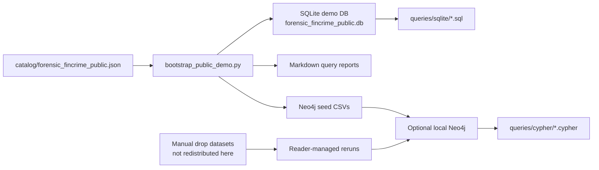
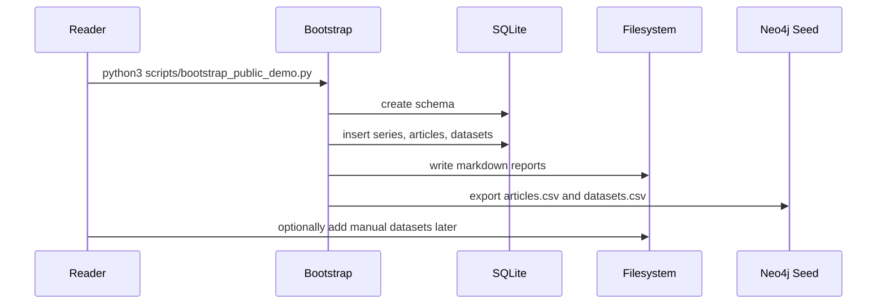

# Architecture

This companion repo is intentionally narrower than the internal Watchdog
investigation workspace.

Its job is to make the public method legible:

1. series knowledge
2. dataset inventory
3. public reproduction scaffolding

## Overview

## Boundary by design

The internal repo remains the working workshop.

The companion repo only exposes:

- article-level technical framing
- dataset inventory and source references
- demo schemas
- example queries
- public reproducibility levels

It excludes:

- private HTML mirrors
- unpublished drafts
- live credentials
- bulk third-party data redistribution

## Reader workflow

